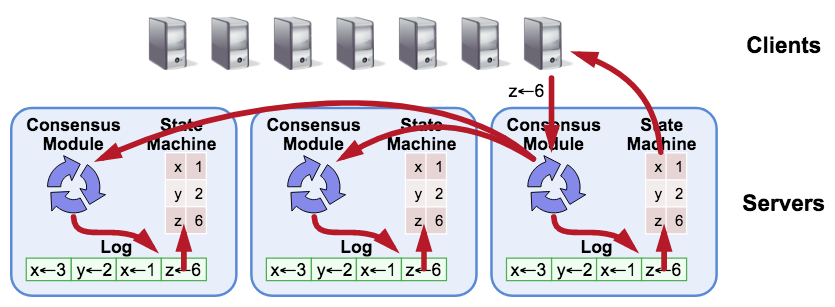

# Raft

[](https://travis-ci.org/pingcap/raft-rs)
[](https://docs.rs/raft/)
[](https://crates.io/crates/raft)
[](https://deps.rs/repo/github/pingcap/raft-rs)

## Problem and Importance

When building a distributed system one principal goal is often to build in *fault-tolerance*. That is, if one particular node in a network goes down, or if there is a network partition, the entire cluster does not fall over. The cluster of nodes taking part in a distributed consensus protocol must come to agreement regarding values, and once that decision is reached, that choice is final.

Distributed Consensus Algorithms often take the form of a replicated state machine and log. Each state machine accepts inputs from its log, and represents the value(s) to be replicated, for example, a hash table. They allow a collection of machines to work as a coherent group that can survive the failures of some of its members.

Two well known Distributed Consensus Algorithms are Paxos and Raft. Paxos is used in systems like [Chubby](http://research.google.com/archive/chubby.html) by Google, and Raft is used in things like [`tikv`](https://github.com/pingcap/tikv) or [`etcd`](https://github.com/coreos/etcd/tree/master/raft). Raft is generally seen as a more understandable and simpler to implement than Paxos.

## Design

Raft replicates the state machine through logs. If you can ensure that all the machines have the same sequence of logs, after applying all logs in order, the state machine will reach a consistent state.

A complete Raft model contains 4 essential parts:

1. Consensus Module, the core consensus algorithm module;

2. Log, the place to keep the Raft logs;

3. State Machine, the place to save the user data;

4. Transport, the network layer for communication.



> Note: This Raft implementation in Rust includes the core Consensus Module only, not the other parts. The core Consensus Module in the Raft crate is customizable, flexible, and resilient. You can directly use the Raft crate, but you will need to build your own Log, State Machine and Transport components.

## Developing the Raft crate

`Raft` is built using the latest version of `stable` Rust, using [the 2018 edition](https://doc.rust-lang.org/edition-guide/rust-2018/).

Using `rustup` you can get started this way:

```bash
rustup component add clippy
rustup component add rustfmt
```

In order to have your PR merged running the following must finish without error:

```bash
cargo test --all && \
cargo clippy --all -- -D clippy::all && \
cargo fmt --all -- --check
```

You may optionally want to install `cargo-watch` to allow for automated rebuilding while editing:

```bash
cargo watch -s "cargo check"
```

### Modifying Protobufs

If proto file `eraftpb.proto` changed, run the command to regenerate `eraftpb.rs`:

```bash
protoc proto/eraftpb.proto --rust_out=src
```

You can check `Cargo.toml` to find which version of `protobuf-codegen` is required.

### Benchmarks

We use [Criterion](https://github.com/japaric/criterion.rs) for benchmarking.

> It's currently an ongoing effort to build an appropriate benchmarking suite. If you'd like to help out please let us know! [Interested?](https://github.com/pingcap/raft-rs/issues/109)

You can run the benchmarks by installing `gnuplot` then running:

```bash
cargo bench
```

You can check `target/criterion/report/index.html` for plots and charts relating to the benchmarks.

You can check the performance between two branches:

```bash
git checkout master
cargo bench --bench benches -- --save-baseline master
git checkout other
cargo bench --bench benches -- --baseline master
```

This will report relative increases or decreased for each benchmark.

## Acknowledgments

Thanks [etcd](https://github.com/coreos/etcd) for providing the amazing Go implementation!

## Projects using the Raft crate

- [TiKV](https://github.com/pingcap/tikv), a distributed transactional key value database powered by Rust and Raft.

## Links for Further Research

* [The Raft site](https://raftconsensus.github.io/)
* [The Secret Lives of Data - Raft](http://thesecretlivesofdata.com/raft/)
* [Raft Paper](http://ramcloud.stanford.edu/raft.pdf)
* [Raft Dissertation](https://github.com/ongardie/dissertation#readme)
* [Raft Refloated](https://www.cl.cam.ac.uk/~ms705/pub/papers/2015-osr-raft.pdf)
* [Implement Raft in Rust](https://www.pingcap.com/blog/implement-raft-in-rust/)
* [Using Raft in Rust at RustConf 2018](https://www.youtube.com/watch?v=MSrcdhGRsOE)
